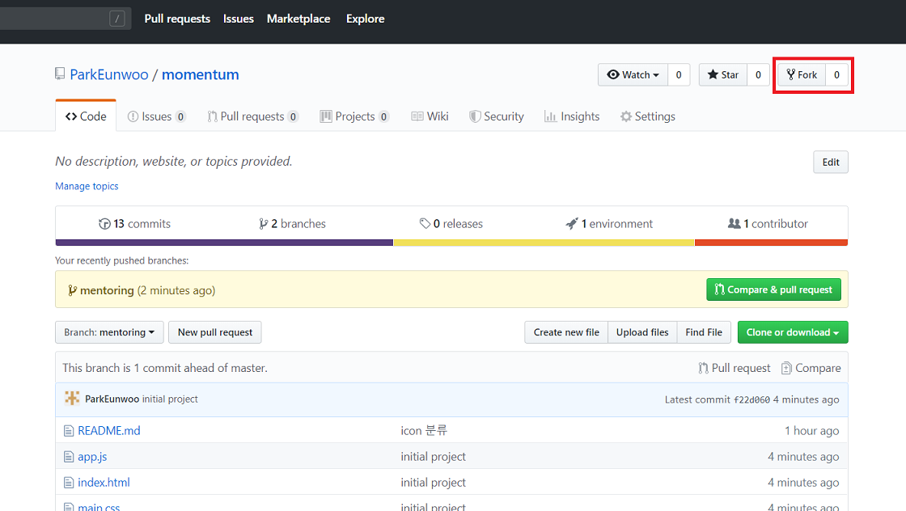
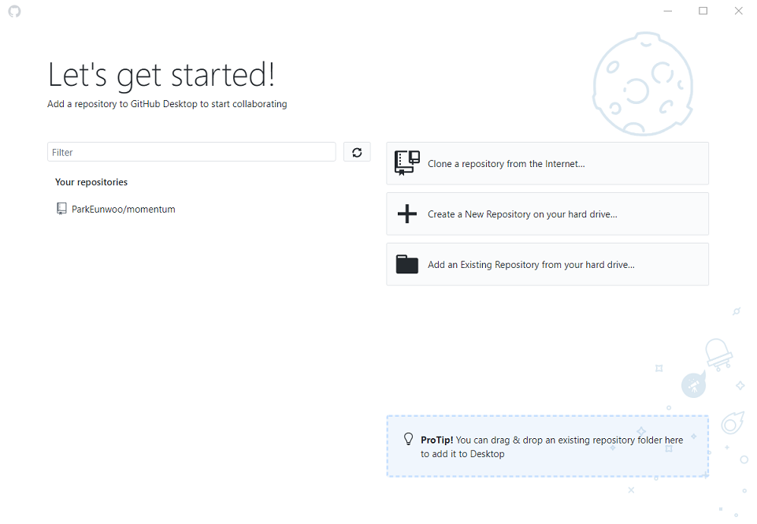
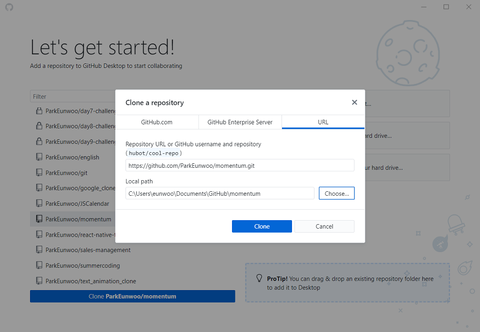
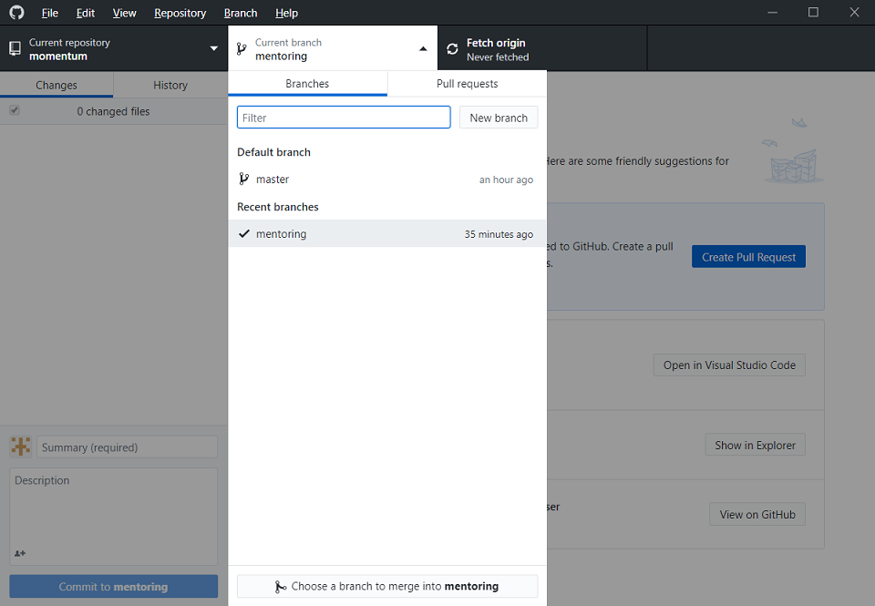

Momentum 만들기
===

일단 따라해보는 웹페이지 만들기 #1
---

목차
---
- GitHub fork하기
- GitHub Desktop으로 git 활용하기
- Html이란?
- layout 작성하기


GitHub fork하기
---

어느 분야에서든 협업은 상당히 중요한 키워드이다. 특히 개발자의 세계에서는 오픈소스라는 개념이 존재하는데 어떠한 프로젝트가 오픈소스로 공개된다면 누구든 해당 프로젝트에 참여해서 협업을 할 수 있게 되는 것이다. 이번 웹페이지를 만드는 프로젝트를 오픈소스로 하여 누구든 참여할 수 있도록 할 것이다.

1. GitHub 페이지에 SignUp 후 SignIn을 한다. [GitHub](https://github.com)
2. 이 프로젝트의 저장소로 이동한다. [저장소](https://github.com/ParkEunwoo/momentum/tree/mentoring)
3. 해당 프로젝트에 참여하고 싶을 때 포크로 찍어서 내 접시로 옮긴다.


이상으로 오픈소스 프로젝트에 참여할 수 있게되었다.

GitHub Desktop으로 git 활용하기
---
git은 작업을 하면서 계속해서 수정사항이 발생하는데 이전 작업했던 기록을 남겨두고 싶을 때 탁월한 기능을 제시해준다.  
> client : ...기능 포함해서 3가지 안을 준비해주세요.  
> client : 3번째 안으로 ...기능 포함해주세요.  
> client : 그냥 첫번째 안으로 하고 ...기능 포함해주세요.
> client : 전체적으로 ...느낌으로 수정해주세요.  
> client : 마지막으로 ...위치 수정할게요.  

결과적으로 다음과 같은 파일들을 갖게 된다.
```
1안.psd
2안.psd
3안.psd
3안(추가).psd
1안(추가).psd
1안(추가)_최종.psd
1안(추가)_최종(진짜최종).psd
```
이를 방지하기 위해 여러 버전들을 관리할 수 있는 도구들이 등장했고 그 중 현재 가장 많이 쓰이는 도구가 git이다.  

git hub desktop을 실행해서 sign in후 다음과 같은 화면을 만나볼 수 있다.  
해당 repository를 선택한 뒤 아래 뜨는 clone을 누른다.

원하는 위치를 선택해서 clone을 시작한다.

나의 작업을 시작하기 위해서 branch라는 것을 만들어야한다.

Current branch를 선택 후 New branch 버튼을 누른다.

name에 자신의 이름을 영어로 적고, Create branch based on...에서 mentoring을 선택하고 브랜치를 생성한다.

이렇게 준비가 끝나면 작업을 하고 저장을 해야할 시점마다 어떤 파일들을 관리할지 Changes에서 선택한 후 Summary에 어떠한 작업을 했는 지 적고 Commit to <브랜치 이름> 을 선택한다. 